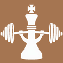
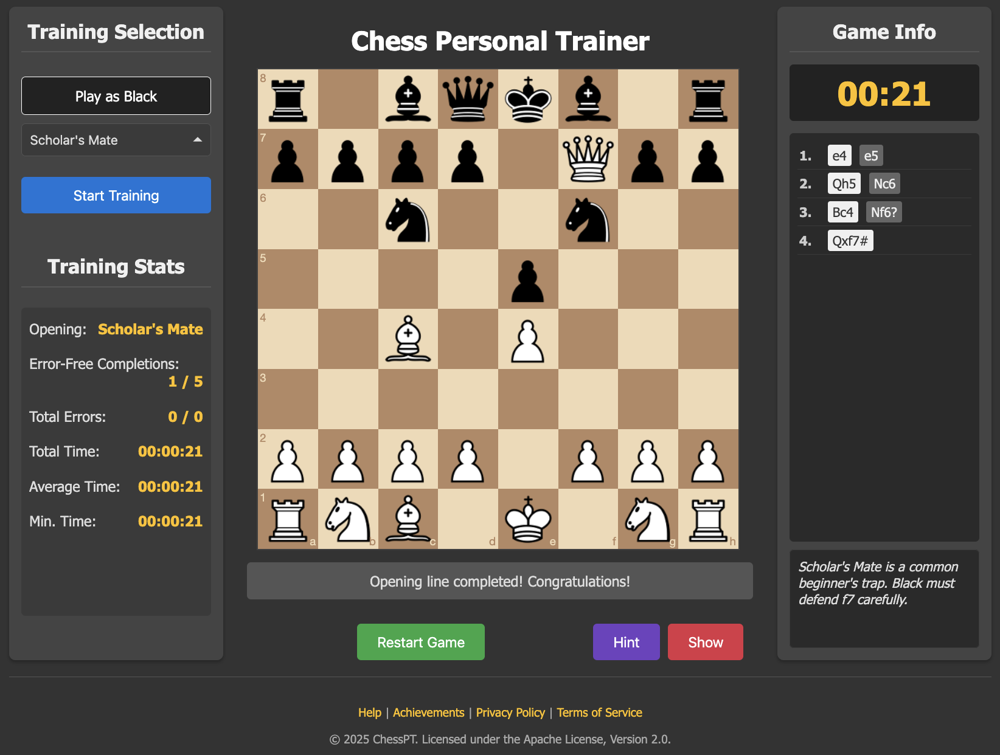

# ChessPT - Chess Personal Trainer

[](https://www.meo.bogliolo.name/ChessPT/) [](https://opensource.org/licenses/Apache-2.0)



**ChessPT is a web-based personal trainer designed to turn chess opening theory into muscle memory. By automating the first moves, you gain a decisive advantage on the clock and on the board, ideal for dominating in fast online games.**

In fast-paced games like blitz and bullet, time is as critical as the pieces themselves. Wasting precious seconds recalling an opening sequence puts you at an immediate disadvantage. The goal of ChessPT is not just to learn theory, but to make it instinct. Through repetition and instant feedback, your brain stops "calculating" the initial moves and starts "recognizing" them as a single, fluid pattern.

This automation allows you to execute your opening quickly and flawlessly, saving mental energy and time for the more complex and decisive phases of the game: the middlegame and the endgame.



## Features

-   **Interactive Training:** Play moves on a clean, simple interface.
-   **Play as White or Black:** Train openings from either perspective.
-   **Guided Opening Lines:** Follow predefined training lines loaded from PGN files.
-   **Instant Feedback:** Get immediate validation on your moves.
-   **Performance Statistics:** Track error-free completions, total errors, and time spent.
-   **Achievement System:** Complete an opening's training objective to save your achievement locally.
-   **Privacy-Focused:** All data is stored in your browser. Nothing is ever collected or transmitted.

## Getting Started

### Prerequisites

You need a local web server to run ChessPT. Due to browser security policies (CORS), you cannot simply open the `index.html` file from your filesystem.

### Installation & Launch

1.  **Clone the repository:**
    ```bash
    git clone https://github.com/your-username/ChessPT.git
    cd ChessPT
    ```

2.  **Start a local web server.** The simplest method is using Python's built-in server:
    ```bash
    python3 -m http.server
    ```
    *(If you use Python 2, the command is `python -m SimpleHTTPServer`)*

3.  **Open the application** by navigating your browser to `http://localhost:8000`.

## How to Use

1.  **Choose Your Color:** Use the "Play as White" or "Play as Black" buttons.
2.  **Select a Training:** Pick an opening from the dropdown menu.
3.  **Start Training:** Click "Start Training" to load the line.
4.  **Play:** Make your moves on the board. The app will guide you.
5.  **Track Progress:** View your stats on the left and see your saved accomplishments on the "Achievements" page.

## Customization

You can easily add your own openings:

1.  Add your opening to a `.pgn` file in the `/pgn` directory. You can add custom headers like `[OpeningNote "Custom note here"]` and `[TargetCompletions "3"]`.
2.  Add a reference to your PGN file in `trainings.json` (for White) or `trainings_black.json` (for Black).

    **Example for `trainings.json`:**
    ```json
    {
        "label": "My Custom Openings",
        "options": [
            { "name": "My Awesome Opening", "file": "pgn/my_awesome_opening.pgn" }
        ]
    }
    ```

## Built With

-   HTML5 & CSS3
-   JavaScript (with jQuery)
-   [chessboard.js](https://chessboardjs.com/) - For the interactive board UI.
-   [chess.js](https://github.com/jhlywa/chess.js) - For game logic and move validation.

## Contributing

Contributions are welcome! If you have suggestions for improvements or new features, feel free to open an issue or submit a pull request.

## License

This project is licensed under the Apache License, Version 2.0. See the [LICENSE](LICENSE) file for details.